# Arquitectura del Sistema de Gestión Documental - FlowCoreX

## Diagrama de Arquitectura

```mermaid
graph TB
    %% Frontend Layer
    subgraph "Frontend (Next.js)"
        UI[Interfaz de Usuario]
        Auth[Autenticación]
        Chat[Chatbot IA]
        Upload[Subida de Documentos]
        Explorer[Explorador de Documentos]
        Dashboard[Dashboard]
        Workflows[Flujos de Trabajo]
    end

    %% API Gateway Layer
    subgraph "API Gateway"
        AG1[API Gateway Principal<br/>7xb9bklzff.execute-api.us-east-1.amazonaws.com/Prod]
        AG2[API Gateway Agencia<br/>8iotue2p03.execute-api.us-east-1.amazonaws.com/dev]
        AG3[API Gateway Expiry Monitor<br/>a43hkqj27a.execute-api.us-east-1.amazonaws.com/Prod]
    end

    %% Lambda Functions
    subgraph "Lambda Functions"
        LF1[Document Service<br/>Gestión de documentos]
        LF2[Auth Service<br/>Autenticación y autorización]
        LF3[Client Service<br/>Gestión de clientes]
        LF4[Chatbot Service<br/>IA y procesamiento de chat]
        LF5[Dashboard Service<br/>Métricas y estadísticas]
        LF6[Audit Service<br/>Registro de auditoría]
        LF7[Workflow Service<br/>Gestión de flujos]
        LF8[Expiry Monitor<br/>Monitoreo de expiración]
        LF9[Agencia Service<br/>Servicios de agencia]
    end

    %% Storage Layer
    subgraph "Storage"
        S3[S3 Bucket<br/>Almacenamiento de documentos]
        DDB[DynamoDB<br/>Base de datos NoSQL]
        RDS[RDS<br/>Base de datos relacional]
    end

    %% AI/ML Services
    subgraph "AI/ML Services"
        BEDROCK[Amazon Bedrock<br/>Modelos de IA]
        COMPREHEND[Comprehend<br/>Análisis de texto]
        TEXTRACT[Textract<br/>Extracción de texto]
        REKOGNITION[Rekognition<br/>Análisis de imágenes]
    end

    %% Monitoring & Security
    subgraph "Monitoring & Security"
        CW[CloudWatch<br/>Monitoreo y logs]
        CWLOGS[CloudWatch Logs<br/>Registros de aplicación]
        IAM[IAM<br/>Gestión de identidades]
        COGNITO[Cognito<br/>Autenticación de usuarios]
        WAF[WAF<br/>Protección web]
    end

    %% Connections
    UI --> AG1
    UI --> AG2
    UI --> AG3
    
    AG1 --> LF1
    AG1 --> LF2
    AG1 --> LF3
    AG1 --> LF5
    AG1 --> LF6
    AG1 --> LF7
    
    AG2 --> LF9
    AG3 --> LF8
    
    LF1 --> S3
    LF1 --> DDB
    LF2 --> COGNITO
    LF2 --> DDB
    LF3 --> DDB
    LF4 --> BEDROCK
    LF4 --> COMPREHEND
    LF5 --> DDB
    LF6 --> CWLOGS
    LF7 --> DDB
    LF8 --> DDB
    LF9 --> S3
    LF9 --> BEDROCK
    
    %% AI Processing
    LF1 --> TEXTRACT
    LF1 --> REKOGNITION
    
    %% Monitoring
    LF1 --> CW
    LF2 --> CW
    LF3 --> CW
    LF4 --> CW
    LF5 --> CW
    LF6 --> CW
    LF7 --> CW
    LF8 --> CW
    LF9 --> CW
    
    %% Security
    AG1 --> WAF
    AG2 --> WAF
    AG3 --> WAF
    
    style UI fill:#e1f5fe
    style AG1 fill:#fff3e0
    style AG2 fill:#fff3e0
    style AG3 fill:#fff3e0
    style LF1 fill:#f3e5f5
    style LF2 fill:#f3e5f5
    style LF3 fill:#f3e5f5
    style LF4 fill:#f3e5f5
    style LF5 fill:#f3e5f5
    style LF6 fill:#f3e5f5
    style LF7 fill:#f3e5f5
    style LF8 fill:#f3e5f5
    style LF9 fill:#f3e5f5
    style S3 fill:#e8f5e8
    style DDB fill:#e8f5e8
    style RDS fill:#e8f5e8
    style BEDROCK fill:#fff8e1
    style COMPREHEND fill:#fff8e1
    style TEXTRACT fill:#fff8e1
    style REKOGNITION fill:#fff8e1
    style CW fill:#ffebee
    style CWLOGS fill:#ffebee
    style IAM fill:#ffebee
    style COGNITO fill:#ffebee
    style WAF fill:#ffebee
```

## Servicios de AWS Utilizados

### 1. **API Gateway**
- **Propósito**: Punto de entrada para todas las APIs del sistema
- **Endpoints identificados**:
  - `https://7xb9bklzff.execute-api.us-east-1.amazonaws.com/Prod` (API Principal)
  - `https://8iotue2p03.execute-api.us-east-1.amazonaws.com/dev` (API Agencia)
  - `https://a43hkqj27a.execute-api.us-east-1.amazonaws.com/Prod` (API Expiry Monitor)
- **Funcionalidades**:
  - Autenticación y autorización
  - Rate limiting
  - CORS management
  - Request/Response transformation

### 2. **Lambda Functions**
- **Document Service**: Gestión completa de documentos (CRUD, versiones, búsqueda)
- **Auth Service**: Autenticación, autorización y gestión de usuarios
- **Client Service**: Gestión de clientes y sus documentos
- **Chatbot Service**: Procesamiento de IA para asistente virtual
- **Dashboard Service**: Generación de métricas y estadísticas
- **Audit Service**: Registro de auditoría y logs de actividad
- **Workflow Service**: Gestión de flujos de trabajo y procesos
- **Expiry Monitor**: Monitoreo de documentos próximos a expirar
- **Agencia Service**: Servicios específicos de agencia con IA

### 3. **Amazon S3**
- **Propósito**: Almacenamiento de documentos y archivos
- **Funcionalidades**:
  - Almacenamiento seguro de documentos
  - URLs prefirmadas para subida directa
  - Versionado de documentos
  - Lifecycle policies para gestión de costos
  - Encriptación en reposo

### 4. **DynamoDB**
- **Propósito**: Base de datos NoSQL para datos estructurados
- **Tablas identificadas**:
  - Usuarios y autenticación
  - Documentos y metadatos
  - Clientes
  - Sesiones de chat
  - Flujos de trabajo
  - Auditoría y logs

### 5. **Amazon Cognito**
- **Propósito**: Gestión de identidades y autenticación
- **Funcionalidades**:
  - User pools para gestión de usuarios
  - Identity pools para acceso a recursos AWS
  - Multi-factor authentication (MFA)
  - Social identity providers
  - Password policies

### 6. **Amazon Bedrock**
- **Propósito**: Modelos de IA para el chatbot
- **Funcionalidades**:
  - Procesamiento de lenguaje natural
  - Generación de respuestas inteligentes
  - Análisis de documentos
  - Extracción de información

### 7. **Amazon Comprehend**
- **Propósito**: Análisis de texto y procesamiento de lenguaje natural
- **Funcionalidades**:
  - Análisis de sentimientos
  - Detección de entidades
  - Clasificación de documentos
  - Extracción de información clave

### 8. **Amazon Textract**
- **Propósito**: Extracción de texto de documentos
- **Funcionalidades**:
  - OCR de documentos escaneados
  - Extracción de tablas y formularios
  - Procesamiento de PDFs
  - Identificación de campos estructurados

### 9. **Amazon Rekognition**
- **Propósito**: Análisis de imágenes y documentos
- **Funcionalidades**:
  - Detección de texto en imágenes
  - Análisis de contenido visual
  - Clasificación de documentos por tipo
  - Verificación de identidad

### 10. **CloudWatch**
- **Propósito**: Monitoreo y observabilidad
- **Funcionalidades**:
  - Métricas de rendimiento
  - Logs de aplicación
  - Alertas automáticas
  - Dashboards de monitoreo

### 11. **CloudWatch Logs**
- **Propósito**: Centralización de logs
- **Funcionalidades**:
  - Recolección de logs de Lambda
  - Búsqueda y filtrado
  - Retención configurable
  - Integración con análisis

### 12. **IAM (Identity and Access Management)**
- **Propósito**: Control de acceso y permisos
- **Funcionalidades**:
  - Roles para Lambda functions
  - Políticas de acceso granular
  - Gestión de credenciales
  - Auditoría de acceso

### 13. **WAF (Web Application Firewall)**
- **Propósito**: Protección de aplicaciones web
- **Funcionalidades**:
  - Protección contra ataques comunes
  - Rate limiting
  - Filtrado de tráfico malicioso
  - Reglas personalizadas

### 14. **RDS (Relational Database Service)**
- **Propósito**: Base de datos relacional (inferido)
- **Funcionalidades**:
  - Almacenamiento de datos estructurados
  - Transacciones ACID
  - Backup automático
  - Escalabilidad

## Arquitectura de Seguridad

### Capas de Seguridad
1. **WAF**: Protección a nivel de aplicación
2. **API Gateway**: Autenticación y autorización
3. **Cognito**: Gestión de identidades
4. **IAM**: Control de acceso granular
5. **S3**: Encriptación en reposo y tránsito
6. **DynamoDB**: Encriptación automática

### Flujo de Autenticación
1. Usuario se autentica vía Cognito
2. Se genera JWT token
3. Token se valida en API Gateway
4. Lambda functions verifican permisos
5. Acceso a recursos según roles

## Patrones de Diseño Implementados

### 1. **Serverless Architecture**
- Sin servidores que mantener
- Escalado automático
- Pago por uso

### 2. **Microservices**
- Servicios independientes
- Comunicación vía APIs
- Despliegue independiente

### 3. **Event-Driven Architecture**
- Triggers automáticos
- Procesamiento asíncrono
- Integración de servicios

### 4. **CQRS (Command Query Responsibility Segregation)**
- Separación de operaciones de lectura y escritura
- Optimización de consultas
- Escalabilidad independiente

## Monitoreo y Observabilidad

### Métricas Clave
- **Performance**: Latencia de APIs, tiempo de respuesta
- **Business**: Documentos procesados, usuarios activos
- **Infrastructure**: Uso de Lambda, almacenamiento S3
- **Security**: Intentos de acceso, errores de autenticación

### Alertas Configuradas
- Errores de Lambda functions
- Latencia alta en APIs
- Uso excesivo de recursos
- Intentos de acceso sospechosos

## Costos y Optimización

### Estrategias de Optimización
1. **Lambda**: Configuración de memoria óptima
2. **S3**: Lifecycle policies para archivos antiguos
3. **DynamoDB**: Capacidad bajo demanda
4. **CloudWatch**: Retención de logs configurada
5. **API Gateway**: Caché para respuestas frecuentes

### Estimación de Costos
- **Lambda**: ~$50-100/mes (dependiendo del uso)
- **S3**: ~$20-50/mes (dependiendo del almacenamiento)
- **DynamoDB**: ~$30-80/mes (dependiendo de las operaciones)
- **API Gateway**: ~$10-30/mes
- **CloudWatch**: ~$20-40/mes
- **AI Services**: ~$100-300/mes (dependiendo del uso)

## Escalabilidad

### Escalado Horizontal
- Lambda functions se escalan automáticamente
- DynamoDB con capacidad bajo demanda
- S3 con escalado ilimitado

### Escalado Vertical
- Configuración de memoria en Lambda
- Tipos de instancia en RDS
- Configuración de DynamoDB

## Disaster Recovery

### Estrategia de Backup
1. **S3**: Replicación cross-region
2. **DynamoDB**: Point-in-time recovery
3. **RDS**: Backup automático
4. **Lambda**: Código en repositorio Git

### Recuperación
- RTO (Recovery Time Objective): < 1 hora
- RPO (Recovery Point Objective): < 15 minutos

## Conformidad y Gobernanza

### Estándares de Seguridad
- SOC 2 Type II
- ISO 27001
- GDPR compliance
- HIPAA (si aplica)

### Auditoría
- Logs completos en CloudWatch
- Trazabilidad de todas las operaciones
- Reportes de cumplimiento automáticos 